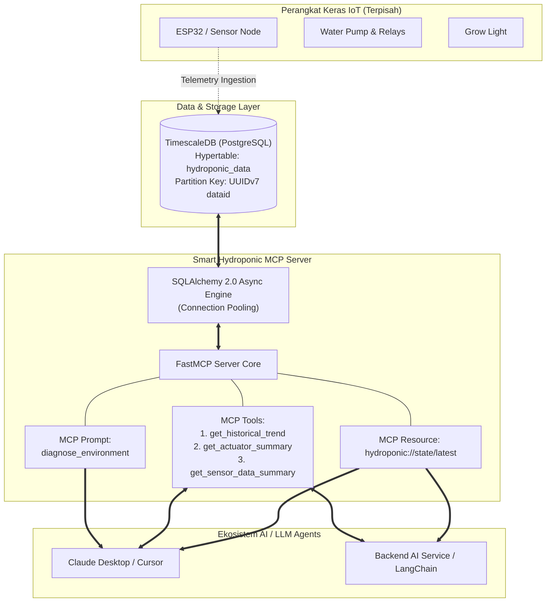
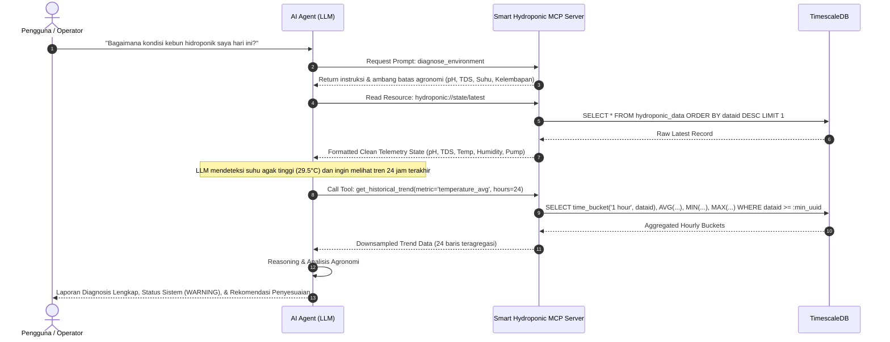

# Arsitektur & Alur Interaksi

Smart Hydroponic MCP Server berfungsi sebagai lapisan jembatan cerdas (*intelligent semantic bridge*) antara database time-series **TimescaleDB** dan **Large Language Models (LLM)**. Server ini menyediakan context feed, resource telemetri, dan tools analitik terparameterisasi tanpa mengizinkan LLM membuat kueri SQL sembarangan.

---

## 🏗️ Diagram Arsitektur Sistem

---

## 🔒 Pemisahan Peran & Batasan Keamanan (Boundary Separation)

1. **MCP Server Sole Responsibility:**
   - Menyediakan data terkini (*real-time snapshot*) melalui resource `hydroponic://state/latest`.
   - Menjalankan agregasi downsampling melalui `time_bucket` per jam untuk metrik historis.
   - Menghitung keandalan sistem (uptime aktuator) secara presisi.
   - Mencegah *SQL Injection* dan *Context Window Overflow* dengan strictly typed tools dan parameterized raw SQL.
2. **Hardware Actuation:**
   - Perangkat keras dan aktuasi relay (pompa, lampu grow light) dikendalikan melalui service terpisah via protokol MQTT/CoAP. MCP Server tidak melakukan manipulasi status fisik secara langsung demi keamanan dan integritas kebun.

---

## 🔄 Alur Kerja Diagnosis Lingkungan (Agentic Sequence)

Alur berikut menggambarkan bagaimana Agen AI menggunakan Resource, Prompt, dan Tools MCP untuk mendiagnosis kondisi kebun secara mandiri:

---

## ⚡ Keunggulan Kombinasi SQLAlchemy 2.0 Core + Parameterized Raw SQL

1. **Koneksi Stabil & Efisien:** Menggunakan `create_async_engine` dan `async_sessionmaker` untuk manajemen pooling koneksi database asyncpg yang terlindungi dengan mekanisme *pre-ping* dan *graceful shutdown*.
2. **Performa Maksimal:** Mengabaikan overhead hidrasi objek ORM Python. Hasil query langsung dialirkan sebagai dictionary (`result.mappings()`).
3. **Pemanfaatan Penuh Fitur TimescaleDB:** Memungkinkan penggunaan langsung fungsi `time_bucket()`, operator interval PostgreSQL, dan perbandingan bit 48-bit UUIDv7 secara native.
