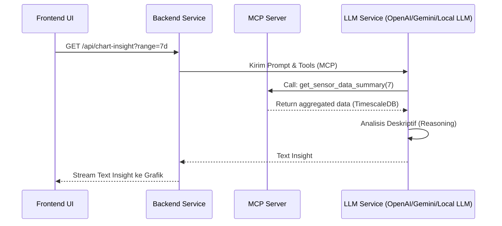

# Arsitektur & Alur Interaksi

!!! note "Status"
    Masih dalam tahap pengembangan (*Work in Progress* / Rencana Masa Depan)

Ke depannya, sistem ini dirancang untuk menggunakan arsitektur *Backend MCP-driven* guna mendukung fitur analisis kecerdasan buatan. Arsitektur ini memprioritaskan keamanan, efisiensi bandwidth, dan penalaran LLM (*multi-step reasoning*).

## Mengapa Backend + MCP?

Dalam pengembangan fitur seperti "Deskripsi Chart dengan LLM", mengunggah data mentah dari *Frontend* ke LLM secara langsung sangat tidak disarankan karena:

- Risiko kebocoran API Key
- *Payload* data grafik bisa terlalu besar dan redundan.
- LLM tidak bisa meminta informasi tambahan secara dinamis.

### Rencana Workflow Agentic

Berikut adalah alur yang sedang dikembangkan:

Berdasarkan rancangan di atas, LLM nantinya akan bertindak sebagai *Agent* yang dapat memanggil *tools* dari MCP Server ini secara mandiri untuk menarik data yang benar-benar ia perlukan dalam menyusun sebuah kesimpulan deskriptif.
